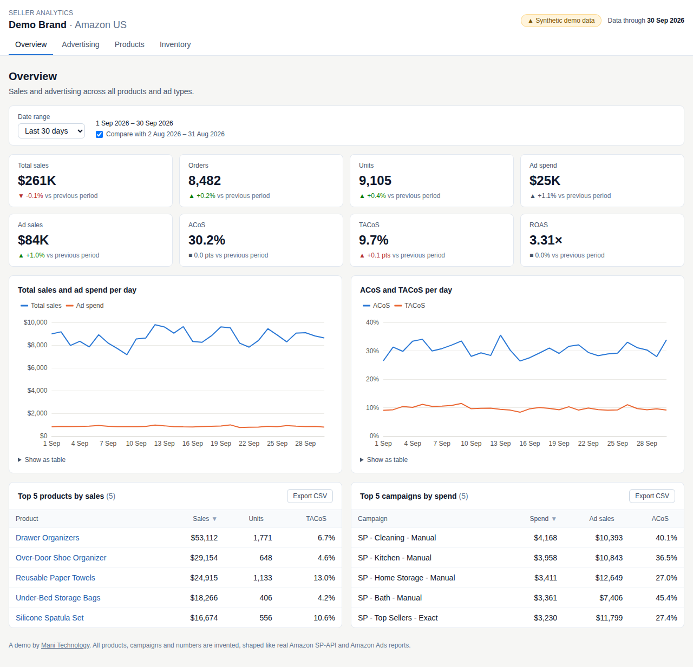
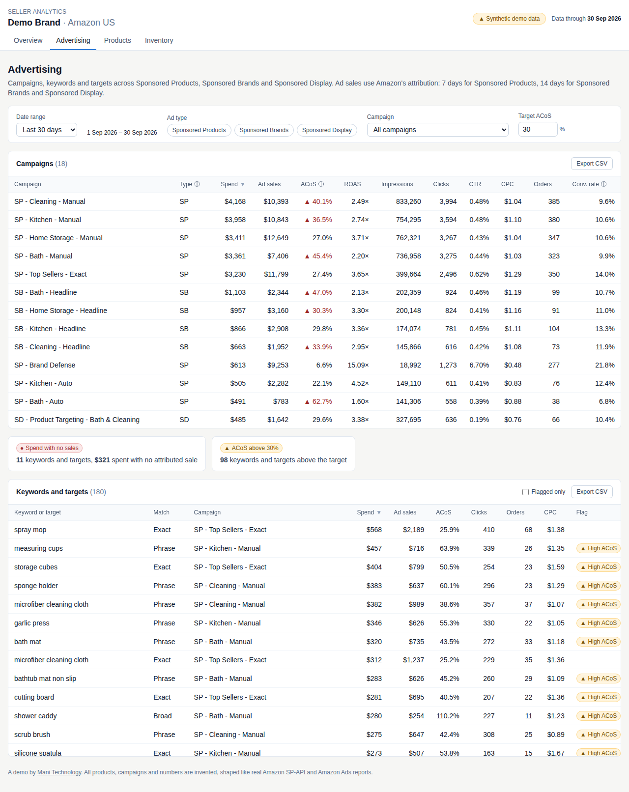
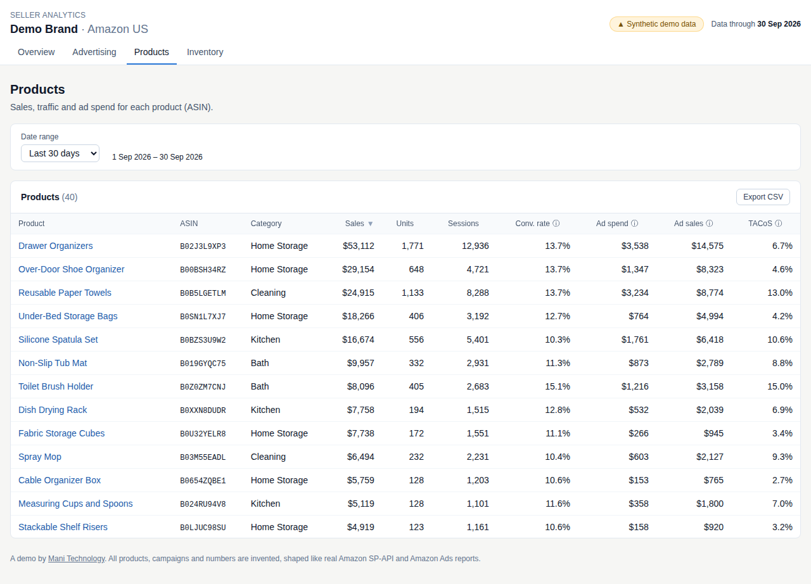
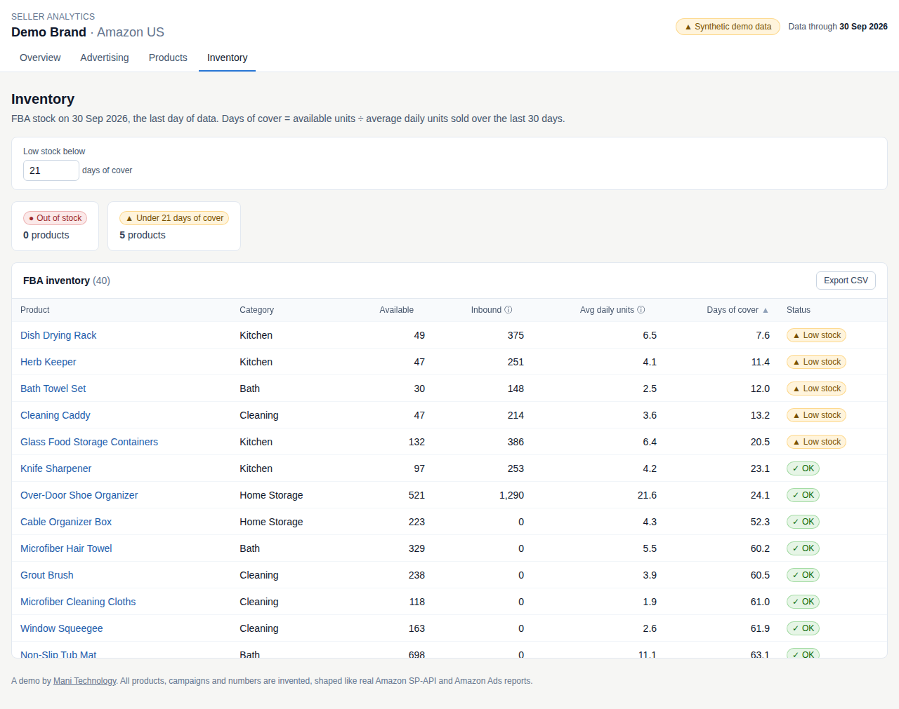

# Amazon Seller Analytics Dashboard

A demo analytics dashboard for an Amazon seller, built by [Mani Technology](https://manitechnology.com). It brings sales, advertising (Sponsored Products, Sponsored Brands and Sponsored Display) and FBA inventory into one view, with metrics such as ACoS, TACoS and ROAS.

All data is synthetic. It is generated for a fictional brand ("Demo Brand") and shaped like real Amazon SP-API and Amazon Ads v3 reports, so a real connector could replace the generator later.

> **Live demo: [demo.manitechnology.com](https://demo.manitechnology.com)** (no login). Version 1 is complete; every merge to `main` deploys automatically. Read the one-page [case study](docs/case-study.md).

## Screenshots

| Overview | Advertising |
| --- | --- |
|  |  |
| **Products** | **Inventory** |
|  |  |

## Pages

| Page | What it shows | Requirements |
| --- | --- | --- |
| Overview | 8 KPI tiles with change against the previous period; daily sales vs ad spend; daily ACoS and TACoS; top 5 products and campaigns | FR-5 to FR-7 |
| Advertising | Campaign table; keyword and target table flagging spend with no sales and ACoS above the target; filters for ad type and campaign | FR-8 to FR-10 |
| Products | Product table (sales, units, sessions, conversion, ad spend, TACoS) and a daily detail page per ASIN | FR-11, FR-12 |
| Inventory | Available and inbound units, average daily units, days of cover, low-stock and out-of-stock flags | FR-13, FR-14 |

Every page shares one filter bar (date presets or a custom range, previous-period comparison, target ACoS, low-stock threshold). Filters live in the URL, so any view can be shared. Every table sorts by any column and exports to CSV.

## How it works

```
Build time:  data generator (Python) → PostgreSQL 16 (raw → staging → marts) → JSON files
Run time:    Cloudflare Pages serves the JSON + a React app; the browser does the date-range maths
```

PostgreSQL only runs at build time, on your machine or in GitHub Actions. The live demo is static files, with no database or server.

## Repository layout

| Path | What it holds |
| --- | --- |
| `pipeline/` | Python project (uv): data generator, database load, SQL models, JSON export, pytest tests |
| `pipeline/generator/` | Synthetic data for the fictional Demo Brand, written as Amazon-shaped report files |
| `pipeline/load.py` | Loads the report files into the `raw` schema |
| `pipeline/models.py` | Builds the `staging` views and `marts` tables from `pipeline/sql/` |
| `pipeline/export.py` | Writes the marts as JSON files to `web/public/data/` (git-ignored) |
| `pipeline/sql/` | SQL scripts for the `raw`, `staging` and `marts` schemas |
| `web/` | React + TypeScript app (Vite, Tailwind CSS), Vitest tests |
| `web/src/data/` | `DataSource` interface and the static JSON version the demo uses |
| `web/src/metrics/` | Date ranges and every metric the dashboard shows, with unit and parity tests |
| `pipeline/parity.py` | The same metrics computed in SQL, for the parity check |
| `docs/` | Metric definitions, case study and screenshots |
| `web/e2e/` | Playwright smoke test of every page, run before and after each deploy |
| `.github/workflows/` | `ci.yml` (checks on every push and pull request) and `deploy.yml` (Cloudflare Pages) |

## Run it locally

You need Docker, [uv](https://docs.astral.sh/uv/) and Node.js 22.

```bash
make install   # Python and web dependencies
make db        # start PostgreSQL 16 in Docker
make data      # generate a year of data, load PostgreSQL, build marts, export JSON
make dev       # run the web app at http://localhost:5173
```

Other commands: `make test` (pytest and Vitest), `make parity` (web metrics against SQL, after `make data`), `make smoke` (production build plus a Playwright browser test of every page), `make lint` (ruff, ESLint, Prettier, TypeScript) and `make format`.

For `make smoke` the first time, install the browsers with `cd web && npx playwright install chromium firefox webkit` (or run one engine with `cd web && npx playwright test --project=chromium`).

The pipeline reads `DATABASE_URL` (see `.env.example`); the default matches `docker-compose.yml`.

## Tests and deployment

Every push and pull request runs four GitHub Actions jobs:

| Job | What it checks |
| --- | --- |
| Pipeline | ruff, then pytest against PostgreSQL 16: repeatable data, Amazon report formats, reconciliation from raw to marts, export size |
| Web | ESLint, Prettier, TypeScript, Vitest unit and component tests, production build |
| Parity | Rebuilds the data and checks every dashboard metric against the same metric computed in SQL |
| Deploy | Runs only when the three above pass. Builds data and site, runs the Playwright smoke test in Chromium, Firefox and WebKit (desktop, Android and iPhone sizes, plus an accessibility check), deploys to Cloudflare Pages, then runs the smoke test again against the deployed URL |

Pull requests deploy to a preview (`https://pr-<number>.<project>.pages.dev`); merges to `main` deploy the live demo at https://demo.manitechnology.com, and the smoke test runs a third time against that address. Deployment needs two repository secrets: `CLOUDFLARE_API_TOKEN` (permission: Account → Cloudflare Pages → Edit) and `CLOUDFLARE_ACCOUNT_ID`. The site is static, so hosting is free and nothing sleeps.

## Synthetic data

`make data` generates 12 months of daily data (1 Oct 2025 to 30 Sep 2026) for a fictional brand with 40 products in four categories, sold in six Amazon marketplaces: US, Canada, Mexico, UK, Germany and France. The same seed always produces byte-identical files, and the US files are byte-identical to v1.0.

| File | Shaped like |
| --- | --- |
| `sales_traffic/<MKT>/YYYY-MM-DD.json` | SP-API `GET_SALES_AND_TRAFFIC_REPORT` (daily, by child ASIN), one folder per marketplace, money in its own currency |
| `fba_inventory/<NETWORK>/YYYY-MM-DD.tsv` | SP-API `GET_FBA_MYI_UNSUPPRESSED_INVENTORY_DATA`, one folder per fulfilment network (US, CA, MX, UK, EU; Germany and France share EU stock) |
| `ads/<MKT>/spCampaigns.json.gz` and seven more | Amazon Ads v3 reports (`timeUnit` DAILY, GZIP_JSON). US has 18 campaigns across Sponsored Products, Brands and Display; UK and Germany have 10 Sponsored Products campaigns each; no ads in CA, MX or FR |
| `marketplaces.json` | Each marketplace's Amazon marketplace ID, currency and fulfilment network |
| `fx/rates.csv` | Monthly USD rate for CAD, MXN, GBP and EUR (synthetic, near real levels) |
| `products.json` | The product catalog, with each marketplace's local price |

The data includes a weekly pattern, a Q4 peak, a January dip, Prime Day and Black Friday spikes with deal prices, two product launches, stockouts caused by late shipments (three in the US, one each in the UK and EU networks), and a few broad or phrase keywords that spend a few hundred dollars a year without selling. Mexico opens in April 2026 and France in February 2026, both ramping up. Over the last 30 days the US is about 60% of revenue, the UK and Germany about 12% each, and Canada, France and Mexico the rest. Ad budgets follow a seasonal pattern (pushed in Q4 and around Prime Day, cut in January), so US TACoS moves between about 9% and 14% by month. Ads stop serving while a product is out of stock. Campaign, targeting and advertised-product reports add up to the same totals, and ad orders never exceed total orders.

Each file is loaded into the `raw` schema unchanged (one JSON record per row, with Amazon's own field names), so a real SP-API or Ads connector could load the same tables. The marketplace comes from the file's folder.

## Data model

| Schema | What it holds |
| --- | --- |
| `raw` | One row per report record, stored as received (JSON with Amazon's field names) |
| `staging` | Views that type and rename each report (`stg_*`) and keep only the newest copy of a record that was loaded twice |
| `marts` | `dim_date`, `dim_product`, `dim_marketplace`, `dim_fx_monthly`, `dim_campaign`, `dim_target`; daily facts `fct_sales_daily`, `fct_ads_campaign_daily`, `fct_ads_target_daily`, `fct_ads_product_daily` (each with a `marketplace` column) and `fct_inventory_daily` (with a `network` column). Money stays in local currency; `dim_fx_monthly` converts it to USD |

Product-level ad spend covers Sponsored Products and Sponsored Display only, because Amazon reports Sponsored Brands spend per campaign. Account totals include all three ad types.

The export writes one compact JSON file per mart (one array per field; Amazon IDs as strings) plus `manifest.json` with the data's date range, `marketplaces.json` and `fx_monthly.json`. Until the new screens arrive, the v1.0 files hold US data only, so the live dashboard is unchanged. Opening a page downloads about 230–550 KB compressed (code plus that page's data), measured with Playwright against a production build; the Advertising page is the largest because of the daily keyword data.

## Metrics

See [docs/metric-definitions.md](docs/metric-definitions.md). Every metric is computed twice: in TypeScript for the dashboard (`web/src/metrics/metrics.ts`) and in SQL (`pipeline/parity.py`). CI checks they agree for every campaign, keyword, product and inventory row over six fixed date ranges, so every number on screen traces back to the database.

## Licence

Copyright (c) 2026 Mani Technology. All rights reserved. The code is public to read, but no licence is granted to reuse it. See [LICENSE](LICENSE).
