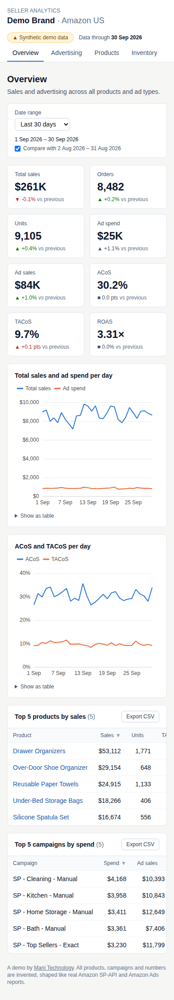

# Case study: Amazon Seller Analytics Dashboard

**Live demo:** [demo.manitechnology.com](https://demo.manitechnology.com) · **Code:** this repository

| | |
| --- | --- |
| Project | Demo project for a fictional Amazon seller ("Demo Brand", US marketplace, 40 products, 18 ad campaigns), on synthetic data |
| What we delivered | Data pipeline, four-page analytics dashboard, automated tests and deployment, public live demo |
| Time | 3 days from approved requirements to live demo |
| Hosting cost | ₹0 a month: static site on Cloudflare Pages, no server to maintain |

## The problem

Amazon sellers, and the agencies that run their ads, work across two tools: Seller Central for sales, traffic and inventory, and the Amazon Ads console for campaigns and keywords. Simple questions take an afternoon of exported reports and spreadsheets. Is advertising paying for itself across the whole business? Which keywords spend money without selling? Which products run out of stock next?

## What we built

One dashboard that puts sales, advertising (Sponsored Products, Sponsored Brands and Sponsored Display) and FBA inventory side by side:

- **Overview:** total sales, orders, units, ad spend, ad sales, ACoS, TACoS and ROAS, each compared with the previous period, with daily trends and the top products and campaigns.
- **Advertising:** every campaign's performance, plus a keyword and target table that flags spend with no sales and ACoS above the seller's target.
- **Products:** sales, sessions, conversion, ad spend and TACoS for each ASIN, with a daily view of any product.
- **Inventory:** available and inbound stock, days of cover, and low-stock and out-of-stock flags.

Filters (date range, comparison, ad type, target ACoS, low-stock threshold) live in the link, so any view can be shared. Every table sorts and exports to CSV, and every page works on a phone.

## How it works

A data generator writes a year of daily data in the exact shape of Amazon's SP-API and Amazon Ads v3 reports. The pipeline loads those reports into PostgreSQL unchanged, then cleans and models them into tables for sales, ads and inventory. It exports compact files that a static React app reads in the browser. To go live for a real seller, a connector to their Amazon accounts replaces the generator, and nothing else changes.

**Stack:** Python, pandas, PostgreSQL · React, TypeScript, Tailwind CSS, ECharts · GitHub Actions, Playwright, Cloudflare Pages.

## How we made sure the numbers are right

- Every metric is calculated twice: once in the dashboard and once in SQL against the database. Automated checks confirm they match for every campaign, keyword, product and inventory row across six date ranges.
- 129 automated tests cover the data pipeline, the metrics and the screens.
- Before and after every release, a browser test opens every page in Chrome, Firefox and Safari engines, at desktop and phone sizes, and runs an accessibility check. It runs again on the live site.
- Every change was reviewed in its own pull request, with its own preview link, before it went live.

## Outcome

- A public, working demo: no login, and each page loads in about a second.
- Code anyone can read, with a README that gets a developer running locally in minutes.
- Delivered in 3 days, against a 3-weekend target.

## What we can build for you

The same foundation connects to your own Seller Central and Amazon Ads accounts through the official APIs. From there we can add scheduled data refresh, profit after COGS and Amazon fees, more marketplaces and currencies, and reports in the format your team already uses. Contact [support@manitechnology.com](mailto:support@manitechnology.com).
